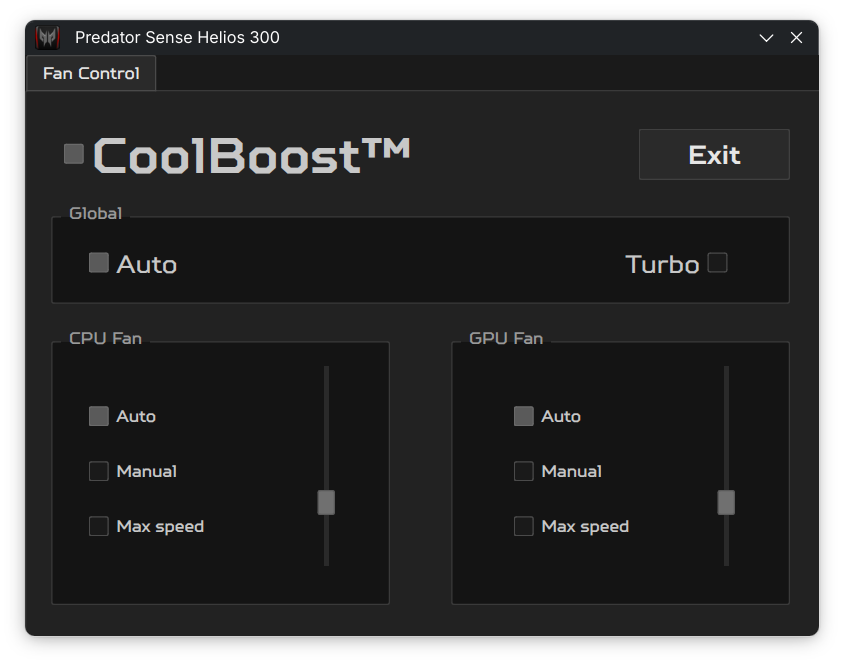

# Predator Sense Helios 300 (Linux, PyQt6)

Linux fan control app for Acer Predator Helios 300 `G3-572-55UB` (2017).



## Safety and support scope

- This build is intentionally scoped to `G3-572-55UB` only.
- It writes to EC registers through `ec_sys`; wrong hardware mappings can damage hardware.
- Secure Boot setups may block module/loading behavior.
- Root privileges are required to write fan/CoolBoost values (desktop launch uses `pkexec`).

## Runtime requirements (Arch)

- `python`
- `python-pyqt6`
- `polkit`
- optional: `evtest`

Kernel/runtime expectations:

- `ec_sys` module available
- debugfs mounted with `/sys/kernel/debug/ec/ec0/io`

## Run from source

```bash
python -m pip install -r requirements.txt
pkexec env DISPLAY=$DISPLAY XAUTHORITY=$XAUTHORITY python main.py
```

## AUR package (`predator-sense`)

The repository includes `PKGBUILD` + `.SRCINFO` for a source package.

Local build test:

```bash
makepkg -si
```

After install:

- Launch via desktop entry **Predator Sense Helios 300**
- or run `predator-sense`
- `predator-sense.service` is enabled at install and starts at boot to keep CoolBoost state applied.

## CI checks

CI validates:

- Ruff lint
- Python compile/syntax checks
- repository smoke test (`scripts/smoke_test.py`)
- basic `PKGBUILD` sanity checks

## Manual hardware validation checklist

On `G3-572-55UB`, verify:

1. App launches and prompts for privilege escalation.
2. CPU fan: Auto, Max speed, and Manual slider modes.
3. GPU fan: Auto, Max speed, and Manual slider modes.
4. CoolBoost toggle on/off behavior.
5. Global Auto/Turbo controls still sync CPU+GPU behavior.

## Origin

This project is based on [PredatorNonSense by kphanipavan](https://github.com/kphanipavan/PredatorNonSense) and later Linux fan-control forks.
