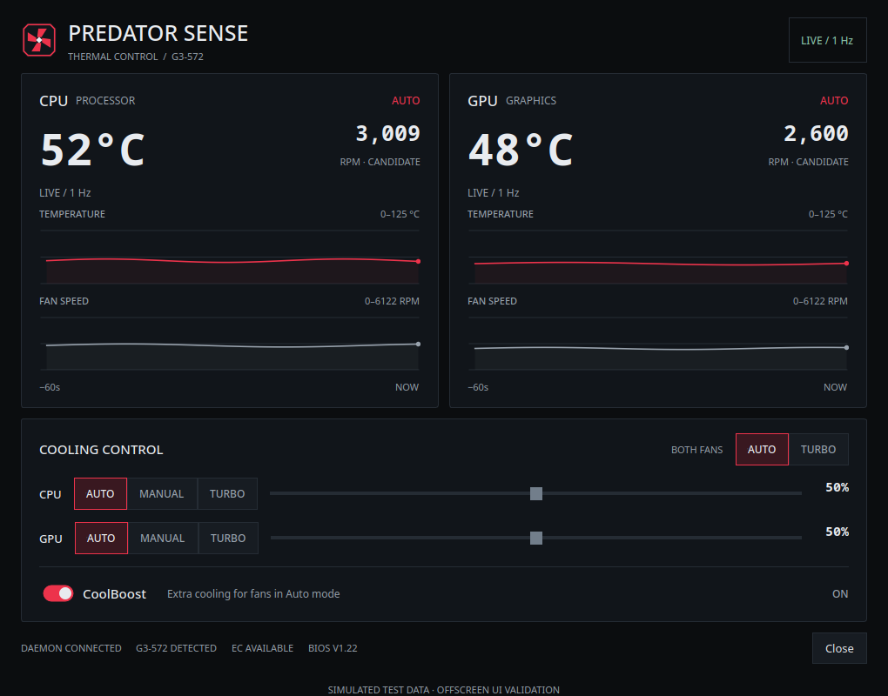

# Predator Sense™ for Helios 300 (2017)

Linux fan control for Acer Predator G3-572 (`G3-572-55UB`). The PyQt6 GUI runs as
your normal desktop user; the `predator-sensed` system daemon owns hardware access.

## Screenshot



Offscreen preview with **simulated test data**; live values come only from the daemon.

## Support

Arch Linux, CachyOS, and compatible Arch-derived distributions are supported.
Hardware access requires the normalized DMI product name `Predator G3-572`.
BIOS `V1.22` is the tested version; other BIOS versions are reported as unvalidated.
No other Acer model is supported.

## Install and run

Build/install with Arch's usual package workflow:

```bash
makepkg -si
predator-sense
```

Installation requires administrator privileges through the package manager and
enables the root hardware service. Run the GUI **without sudo or pkexec**. It
refuses root launches. The launcher preserves your session environment: Qt uses
Wayland on a Wayland session and X11 on an X11 session. The package includes
`qt6-wayland`; no platform override is applied.

Runtime packages: `python`, `python-pyqt6`, `python-dbus-next`, `polkit`, `dbus`,
`qt6-wayland`, and `qt6-svg`. Optional `python-nvidia-ml-py` supplies NVIDIA GPU temperatures
using the installed NVIDIA driver. An active desktop Polkit authentication agent is required for
control actions (normally supplied by Plasma). Reads do not prompt. Mutations
require administrator authentication, retained temporarily by Polkit; slider
changes are debounced and only one control request is outstanding at a time.

Upgrading disables/stops the legacy `predator-sense.service`. Its existing
`/var/lib/predator-sense/state.json` is preserved. The new daemon restores a valid
cooling configuration at startup and after logind resume. Legacy CoolBoost-only
preferences migrate to explicit Auto fan modes. There is no continuous register
enforcement loop. See the lifecycle policy below.

## Run the GUI from source

With the matching packaged daemon/D-Bus policy already installed:

```bash
python -m pip install -r requirements.txt
python src/main.py
```

Installing Python dependencies alone does not install the system service, bus
policy, or Polkit action. Without the daemon, the GUI stays open, disables controls,
and shows an actionable status. It retries automatically. Root access, DMI reads,
EC access, and system state writes never take place in the GUI process.

## Telemetry

The daemon publishes one cached snapshot per second. CPU temperature comes from
`coretemp` sysfs, preferring `Package id 0` and falling back to the hottest readable
coretemp input. GPU temperature uses NVIDIA's `nvidia-ml-py` binding (`pynvml`),
available as the optional Arch package `python-nvidia-ml-py`. The binding and a
working GTX 1050 Ti NVIDIA driver must be available to the daemon's system Python;
a GUI virtual environment alone does not provide the daemon's dependencies.

Snapshots include temperatures, candidate EC fan RPM, fan modes, CoolBoost, manual
percentages, timestamps, and per-sensor availability/errors. Missing readings are
`None`, and old readings become explicitly stale. CPU, GPU, and EC reads run in
separate bounded workers, so a slow GPU cannot freeze the window. There are no
per-second subprocesses or telemetry disk writes.

`ServiceClient.telemetry_updated(snapshot)` and its bounded `history` (120 samples)
drive the native dashboard: CPU/GPU temperature and candidate RPM cards, four
60-second QPainter graphs, per-fan Auto/Manual/Turbo selectors, global Auto/Turbo,
and CoolBoost. Missing values show a dash and an explanation; missing graph samples
remain gaps. Sliders show percentages, commit mouse drags on release, and debounce
keyboard changes for 250 ms. CoolBoost is editable when at least one fan is in Auto.

The window resizes, adapts its card layout, and scrolls when larger fonts or smaller
screens need more space. It uses system fonts, a centralized dark/red theme, and
an SVG icon; the bundled Squares fonts are neither loaded nor installed because
their licence remains unconfirmed. No Qt platform override or root GUI is used.

## Troubleshooting

Inspect service status and logs without launching a root GUI:

```bash
systemctl status predator-sensed.service
journalctl -u predator-sensed.service -b
```

If the service is installed but stopped, an administrator can start it using
`systemctl start predator-sensed.service` (the desktop may request authentication).
D-Bus activation can also start it on demand. Authentication cancellation or denial
leaves the GUI open. Check the active session's Polkit agent if no dialog appears.
If a request times out, refresh observed state before retrying because a hardware
change may already have happened.

The daemon alone prepares `ec_sys`, after checking DMI. It reports missing EC,
debugfs, permissions, unsupported hardware, and verification failures. Do not use
other-model WMI overrides. Read-only diagnostics use the daemon for cooling data:

```bash
python scripts/collect_diagnostics.py --gpu-sample-seconds 0
```

The diagnostics report still contains host/path/process information from system
commands; inspect it before sharing. A zero-duration GPU sample currently executes
one sample. This is an existing diagnostics limitation, not a telemetry loop in
the GUI or daemon.

## Validate fan readings

With the matching daemon already running, observe cached fan data without changing
hardware or starting the daemon:

```bash
python scripts/validate_fan_telemetry.py --samples 60 --label auto
python scripts/validate_fan_telemetry.py --samples 60 --label manual-50
```

Output is timestamped CSV on stdout at 1 Hz, with CPU/GPU candidate RPM, availability,
modes, CoolBoost, manual settings, temperatures, and daemon sample sequence. Labels
only annotate output. Use the GUI separately to compare Auto, Auto + CoolBoost,
Manual approximately 30%, 50%, 70%, and Turbo; allow each setting to settle before
recording. Capture BIOS V1.22, workload, temperatures, and independent reference
readings when comparing. Do not run another EC control tool concurrently.

The tool pins an existing daemon owner and refuses auto-activation, avoiding a
startup-triggered cooling-state restore. It stops if that owner disappears. It neither
opens EC directly nor sends control requests. Unknown/stale values print
`Unavailable`; an actual zero prints `0`. Repeated sequence numbers mean the same
cached sample. No smoothing or scaling is applied. NBFC confirms the read map and
little-endian convention, but absolute RPM units and physical channel correlation
still need on-device validation; see [ARCHITECTURE.md](ARCHITECTURE.md).

## Development checks

Use an isolated Python 3.12 environment and `requirements-dev.txt`:

```bash
ruff check .
PYTHONPATH=src QT_QPA_PLATFORM=offscreen python -m unittest discover -s tests -v
python scripts/smoke_test.py
```

Tests use fake hardware, temporary DMI/state/logs, and a private `dbus-daemon`
instance for Qt/dbus-next integration. The private-bus fixture includes a fake
Polkit authority; it never contacts the system bus. No root or hardware access is
required. The offscreen platform override is test-only. Private-bus tests are
skipped when `dbus-daemon` is unavailable; CI checks for it explicitly.

Render the dashboard with simulated data (no hardware or system bus):

```bash
PYTHONPATH=src QT_QPA_PLATFORM=offscreen python tests/render_dashboard.py /tmp/predator-ui
PYTHONPATH=src QT_QPA_PLATFORM=offscreen QT_SCALE_FACTOR=1.25 python tests/render_dashboard.py /tmp/predator-ui-125
```

An optional three-minute offscreen Qt soak introduces fake GPU stalls/failures:

```bash
PYTHONPATH=src QT_QPA_PLATFORM=offscreen python tests/telemetry_soak.py
```

See [ARCHITECTURE.md](ARCHITECTURE.md) for the wire API, hardware evidence,
security boundary, known limitations, and remaining physical validation.

## Disclaimer

This community project is provided without warranty. Hardware control can affect
your device. Supplied physical observations confirm manual 50%; the full control
range and candidate RPM telemetry still require real-device validation.

## Based On

This project is based on https://github.com/mohsunb/PredatorSense.
The unresolved license and asset provenance findings are recorded in ARCHITECTURE.md.


### Cooling state and service lifecycle

The system daemon runs independently of the GUI and is enabled at boot by the
Arch package hooks. Verified CPU/GPU modes, applicable manual percentages and
CoolBoost are saved atomically under `/var/lib/predator-sense/`.
Fresh or invalid settings select explicit Auto for both fans and CoolBoost Off.
Legacy CoolBoost-only files migrate to Auto with the saved CoolBoost preference.

Logind suspend/resume notifications pause controls and trigger guarded recovery.
Missing EC access retries with backoff; failed setting writes report degraded
status and attempt Auto once. Closing/reopening the GUI never changes fan state.
An intentional service stop attempts Auto/Auto/Off while preserving preferences
for restart. This cleanup cannot be guaranteed after SIGKILL, power loss, kernel
panic or hardware failure. Reboot and suspend behavior still need physical
G3-572 validation; see [ARCHITECTURE.md](ARCHITECTURE.md).
