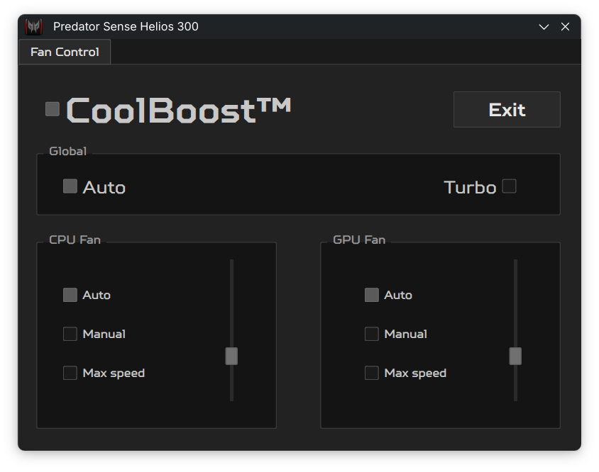

# Predator Sense™ for Helios 300 (2017)

Linux fan control for Acer Predator G3-572 (`G3-572-55UB`). The PyQt6 GUI runs as
your normal desktop user; the `predator-sensed` system daemon owns hardware access.

## Screenshot



## Support

Arch Linux, CachyOS, and compatible Arch-derived distributions are supported.
Hardware access requires the normalized DMI product name `Predator G3-572`.
BIOS `V1.22` is the tested version; other BIOS versions are reported as unvalidated.
No other Acer model is supported.

## Install and run

Build/install with Arch's usual package workflow:

```bash
makepkg -si
predator-sense
```

Installation requires administrator privileges through the package manager and
enables the root hardware service. Run the GUI **without sudo or pkexec**. It
refuses root launches. The launcher preserves your session environment: Qt uses
Wayland on a Wayland session and X11 on an X11 session. The package includes
`qt6-wayland`; no platform override is applied.

Runtime packages: `python`, `python-pyqt6`, `python-dbus-next`, `polkit`, `dbus`,
and `qt6-wayland`. An active desktop Polkit authentication agent is required for
control actions (normally supplied by Plasma). Reads do not prompt. Mutations
require administrator authentication, retained temporarily by Polkit; slider
changes are debounced and only one control request is outstanding at a time.

Upgrading disables/stops the legacy `predator-sense.service`. Its existing
`/var/lib/predator-sense/state.json` is preserved. The new daemon restores a valid
saved CoolBoost preference once at startup, then applies changes on request.
There is no 15-second enforcement loop. Firmware resets after suspend may require
reapplying CoolBoost; continuous enforcement is deliberately absent.

## Run the GUI from source

With the matching packaged daemon/D-Bus policy already installed:

```bash
python -m pip install -r requirements.txt
python src/main.py
```

Installing Python dependencies alone does not install the system service, bus
policy, or Polkit action. Without the daemon, the GUI stays open, disables controls,
and shows an actionable status. It retries automatically. Root access, DMI reads,
EC access, and system state writes never take place in the GUI process.

## Troubleshooting

Inspect service status and logs without launching a root GUI:

```bash
systemctl status predator-sensed.service
journalctl -u predator-sensed.service -b
```

If the service is installed but stopped, an administrator can start it using
`systemctl start predator-sensed.service` (the desktop may request authentication).
D-Bus activation can also start it on demand. Authentication cancellation or denial
leaves the GUI open. Check the active session's Polkit agent if no dialog appears.
If a request times out, refresh observed state before retrying because a hardware
change may already have happened.

The daemon alone prepares `ec_sys`, after checking DMI. It reports missing EC,
debugfs, permissions, unsupported hardware, and verification failures. Do not use
other-model WMI overrides. Read-only diagnostics use the daemon for cooling data:

```bash
python scripts/collect_diagnostics.py --gpu-sample-seconds 0
```

The diagnostics report still contains host/path/process information from system
commands; inspect it before sharing. A zero-duration GPU sample currently executes
one sample. This is an existing diagnostics limitation, not a telemetry loop in
the GUI or daemon.

## Development checks

Use an isolated Python 3.12 environment and `requirements-dev.txt`:

```bash
ruff check .
PYTHONPATH=src QT_QPA_PLATFORM=offscreen python -m unittest discover -s tests -v
python scripts/smoke_test.py
```

Tests use fake hardware, temporary DMI/state/logs, and a private `dbus-daemon`
instance for Qt/dbus-next integration. The private-bus fixture includes a fake
Polkit authority; it never contacts the system bus. No root or hardware access is
required. The offscreen platform override is test-only. Private-bus tests are
skipped when `dbus-daemon` is unavailable; CI checks for it explicitly.

See [ARCHITECTURE.md](ARCHITECTURE.md) for the wire API, hardware evidence,
security boundary, known limitations, and remaining physical validation.

## Disclaimer

This community project is provided without warranty. Hardware control can affect
your device. Supplied physical observations confirm manual 50%; the full control
range and candidate RPM telemetry still require real-device validation.

## Based On

This project is based on https://github.com/mohsunb/PredatorSense.
The unresolved license and asset provenance findings are recorded in ARCHITECTURE.md.
